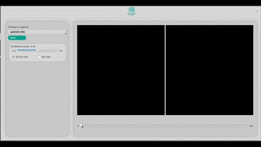

# Tumor-Detector-demo

---


## Requerimentos
- [Docker](https://www.docker.com)
- [Git](https://git-scm.com)
- Linux
  - *Caso o OS seje outro, a etapa 4 da instalação precisa passar o caminho correto para o caminho/para/.X11:/tmp/.X11-unix*

## Instalação
- 1 - *Clone o repositório e vá para dentro dele*
```
git clone https://github.com/brain-facens/Tumor-Detector--demo
cd Tumor-Detector--demo
```
- 2 - *Construa a imagem Docker em sua maquina*
```
docker build -t tumor-detector-img .
```
- 3 - *Libere as permissões para o Docker*
```
xhost +local:docker
```
- 4 - *Crie um container da imagem*
```
docker images # busque pelo id da imagem
```
```
docker run -n tumor-detector -e DISPLAY=$DISPLAY -v /tmp/.X11-unix:/tmp/.X11-unix <id-da-imagem>
```
- 5 - *Inicialize o container nas futuras vezes*
```
docker ps -a # busque pelo id do container
```
```
docker start <id-do-container> # pelo id
```
```
docker start tumor-detector # pelo nome
```
